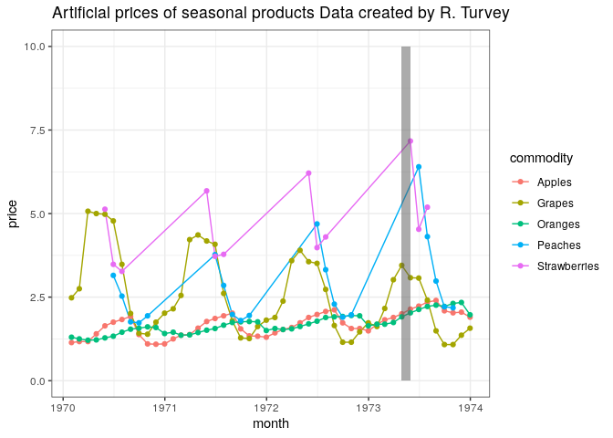
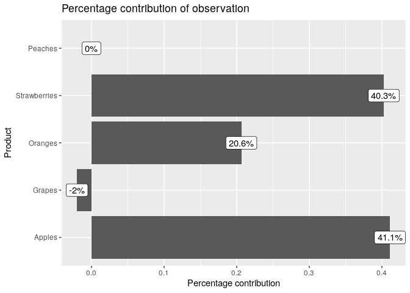

<!-- README.md is generated from README.Rmd. Please edit that file -->
GEKS-Törnqvist Decomposition
============================

This package focuses on one function `GEKSdecomp`, which decomposes the
multilateral GEKS-Tornqvist index into the contributions of individual
commodities. The calculation is based purely on the *Decomposing
Multilateral Price Indexes into the Contributions of Individual
Commodities* paper written by *Michael Webster* and *Rory C.
Tarnow-Mordi*. It uses the techinque described under section [2.2
Decomposition of the CCD and GEKS
Methods](https://www.researchgate.net/publication/333875150_Decomposing_Multilateral_Price_Indexes_into_the_Contributions_of_Individual_Commodities).

This package should be coupled with the [GEKS
package](https://github.com/MjStansfi/GEKS_package). Also see the
alternates available for the FEWS (time product dummy) multilateral
method [FEWS package](https://github.com/MjStansfi/FEWS_package) and
[TPD decomposition](https://github.com/MjStansfi/TPDDecomp).

See the attached pdf to understand how the code was simplified for
conditions where either price a or b is missing.

Installation
============

The GEKS decomposition function can be installed from GitHub using the
following code

``` undefined
devtools::install_github("MjStansfi/GEKSdecomp")
```

``` r
# Once installed, the package can be loaded as usual
library(GEKSdecomp)
```

Usage
=====

The primary function provided by the the package is the `GEKS_decomp()`
function. Running `?GEKS_decomp()` will give all the required
information on how to use the function. An example of running the
`GEKS_decomp()` the function is shown below.

Example
=======

This pacakge includes the Turvey dataset as found in the [Consumer Price
Index
Manual](https://www.ilo.org/wcmsp5/groups/public/---dgreports/---stat/documents/presentation/wcms_331153.pdf).

``` r
library(ggplot2)
ggplot(turvey, aes(x = month, y = price)) + 
  geom_line(aes(color = commodity)) + 
  geom_point(aes(color = commodity))+
  theme_bw() +
  ggtitle("Artificial prices of seasonal products Data created by R. Turvey")+
  annotate("rect", xmin=as.Date("1973-04-30"), xmax=as.Date("1973-05-31"), ymin=0, ymax=10, 
           alpha = .5)
```



The decomposition of the Turvey dataset with the contributions between
1973-04-30 and 1973-05-31 can be seen below.

``` r
#Make sure you restart your session if just installed

str(turvey)
#> 'data.frame':    176 obs. of  4 variables:
#>  $ month    : Date, format: "1970-01-31" "1970-01-31" ...
#>  $ commodity: Factor w/ 5 levels "Apples","Grapes",..: 1 2 3 1 2 3 1 2 3 1 ...
#>  $ price    : num  1.14 2.48 1.3 1.17 2.75 1.25 1.17 5.07 1.21 1.4 ...
#>  $ quantity : int  3086 82 10266 3765 35 9656 4363 9 7940 4842 ...
# 'data.frame': 176 obs. of  4 variables:
#  $ month    : Date, format: "1970-01-31" "1970-01-31" "1970-01-31" "1970-02-28" ...
#  $ commodity: Factor w/ 5 levels "Apples","Grapes",..: 1 2 3 1 2 3 1 2 3 1 ...
#  $ price    : num  1.14 2.48 1.3 1.17 2.75 1.25 1.17 5.07 1.21 1.4 ...
#  $ quantity : int  3086 82 10266 3765 35 9656 4363 9 7940 4842 ...

contributions <- with(
    turvey,
    GEKS_decomp(times = month,
               price = price,
               id = commodity,
               weight = price*quantity,
               custom_time = c("1973-04-30","1973-05-31"),
               window_length = NULL)
 )
#> Comparing change 1973-04-30 to 1973-05-31 
#> 1 / 5 2 / 5 3 / 5 4 / 5 5 / 5 

print(contributions)
#>          from         to           id   contrib   p_contrib
#> 1: 1973-04-30 1973-05-31       Apples 1.0349661  0.41102263
#> 2: 1973-04-30 1973-05-31       Grapes 0.9983307 -0.01998064
#> 3: 1973-04-30 1973-05-31      Oranges 1.0174108  0.20642793
#> 4: 1973-04-30 1973-05-31 Strawberries 1.0342314  0.40253008
#> 5: 1973-04-30 1973-05-31      Peaches 1.0000000  0.00000000
```


